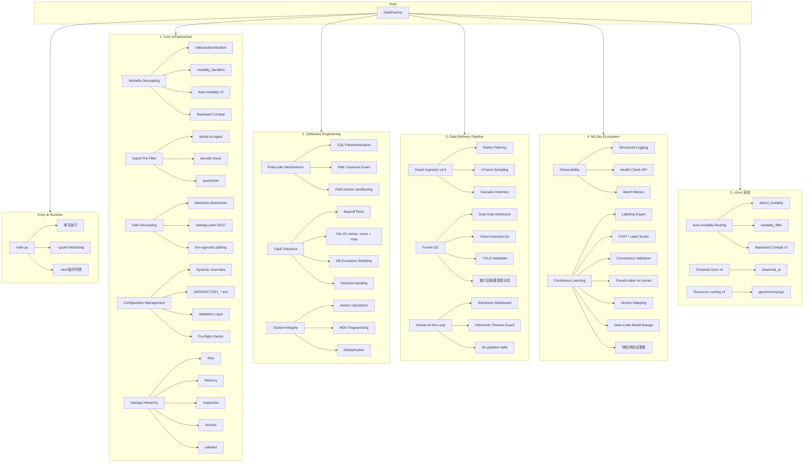

# DataFactory 架构思维导图骨架

> 完整复盘：系统骨架一览。Flowchart 版本可导入 [mermaid-to-excalidraw.vercel.app](https://mermaid-to-excalidraw.vercel.app/) 后导出为 `.excalidraw`，在 Excalidraw 中打开编辑。

---

## 1. Core Infrastructure（骨架/底座）

| 概念                       | 实现                                                                                         |
| ------------------------ | ------------------------------------------------------------------------------------------ |
| **Path Decoupling**      | `config/settings.yaml` paths；`get_batch_paths()`、`get_batch_media_subdirs()`               |
| **Hardware Abstraction** | 路径集中配置；`DATAFACTORY_RAW_VIDEO` 等 env 覆盖                                                    |
| **Modality 解耦**           | `config modality`；`modality_handlers.decode_check` 按 modality 分发；v3 Auto-modality routing 按文件自动识别并路由 |
| **Ingest 预检**            | dedup + decode_check（按 modality）；失败项移入 `quarantine/duplicate`、`quarantine/decode_failed` |
| **SSOT**                 | 批次目录名、前缀、后缀均在 settings.yaml                                                                |
| **Validation Layer**     | `validate_config()`：min<max、gate 范围、双门槛一致性                                                 |
| **Storage Hierarchy**    | raw → archive/rejected/redundant；quarantine（预检）；Batch 内 reports/source/refinery/inspection/labeled（标注回传写回） |

---

## 2. Defensive Engineering（防错/加固）

| 概念                         | 实现                                                             |
| -------------------------- | -------------------------------------------------------------- |
| **SQL Parameterization**   | db_tools 使用参数化查询                                               |
| **Path Traversal Guard**   | dashboard `get_thumbnail`：`Path.resolve()` + `relative_to()`   |
| **Backoff Retry**          | `retry_utils.safe_move_with_retry`、`safe_copy_with_retry`；move/copy 失败打 warning、计入 metrics |
| **DB Exception Shielding** | 捕获 `sqlite3.Error`，记录日志，返回 None/False                          |
| **MD5 Fingerprinting**     | fingerprinter；production_history 去重                            |

---

## 3. Data Refinery Pipeline（生产/提纯）

| 概念                          | 实现                                                                   |
| --------------------------- | -------------------------------------------------------------------- |
| **Motion Filtering**        | `motion_filter.py`；`vision.motion_threshold`                         |
| **I-Frame Sampling**        | `frame_io.py`；`vision.use_i_frame_only`                              |
| **Cascade Detection**       | vision_detector 轻量模型初筛                                               |
| **Dual-Gate Admission**     | `dual_gate_high` / `dual_gate_low`；auto-pass / blocked / auto-reject |
| **Vision-Assisted QA**      | YOLO 抽帧推理；工业/智能报告                                                    |
| **Admission Dashboard**     | `dashboard/app.py`；`/api/pending`；approve/reject                     |
| **Admission Timeout Guard** | `mode=terminal` 时 600s 超时；`mode=dashboard` 无超时丢料                     |
| **放行后按置信度分流**       | `archiver._split_approved_by_vision_conf()`；`approved_split_confidence_threshold`；高置信 → refinery，低置信 → inspection；vision 未开启则全部 refinery |
| **Guard 模式**              | `main.py --guard`；`core/guard.py`；Watchdog 监听 raw_video + 轮询兜底；新视频落地 → 等写入稳定 → 凑批送厂；开机扫描存量 |

---

## 4. MLOps Ecosystem（闭环/观测）

| 概念                         | 实现                                                           |
| -------------------------- | ------------------------------------------------------------ |
| **Structured Logging**     | RotatingFileHandler；`logs/factory_YYYY-MM-DD.log`            |
| **Health Check API**       | `GET /api/health`                                            |
| **Batch Metrics**          | `GET /api/metrics`；`engines/metrics.py`；file_move_errors_total、file_copy_errors_total |
| **Labeling Export**        | `scripts/export_for_labeling.py`；`storage/for_labeling`      |
| **Consistency Validation** | `import_labeled_return.py`；IoU 匹配；一致率门槛；达标后 copy_to_batch_labeled 写回 Batch_xxx/labeled（safe_copy 防静默失败） |
| **Version Mapping**        | `version_info.json`；algorithm_version / vision_model_version |
| **MLflow 存储**            | `tracking_uri` 默认 `sqlite:///db/mlflow.db`，与 factory_admin.db 同目录 |
| **待标池自动更新**         | `labeling_export.auto_update_after_batch()`；每批归档后自动将 inspection 追加到 for_labeling；`labeling_pool.auto_update_after_batch` 配置 |

---

## 5. Entry & Runtime Modes（入口与运行模式）

| 模式 | 命令 | 实现 |
|------|------|------|
| **单次运行** | `python main.py` | 扫描 raw_video → 跑 pipeline → 退出 |
| **Guard 模式** | `python main.py --guard` | `core/guard.py`；Watchdog + 轮询兜底；持续监控 raw，凑批自动送厂 |
| **测试模式** | `python main.py --test` | 临时目录跑全链路；从 `paths.test_source` 复制到 temp/raw；邮件照发；退出后自动清理，不污染真实 storage/DB |

---

## 6. v3/v4 演进设计（Roadmap）

| 概念 | 版本 | 实现 |
|------|------|------|
| **Auto-modality Routing** | v3 | `detect_modality(path)` 按扩展名/内容识别；`modality_filter` 替代 `modality`；按 modality 分组路由 |
| **Backward Compatibility** | v3 | 旧 `modality: "video"` 等价 `modality_filter: ["video"]`；config_loader 平滑迁移 |
| **Temporal Sync** | v4 | 入库统一 `observed_at` 字段；多模态时间对齐，支持「10:00 震动 + 10:00 视频」融合分析 |
| **Resource Locking** | v4 Edge | modality_handlers 声明 `required_resources`（gpu/memory/cpu）；调度层串行/排队防 Edge 跑崩 |

详见 **docs/Roadmap.md**：Auto-modality Routing、阶段三（模型就绪）、阶段四（多模态、Edge）。

---

*文档版本：v2.10 | 补全 Guard、--test、放行分流、待标池自动更新*