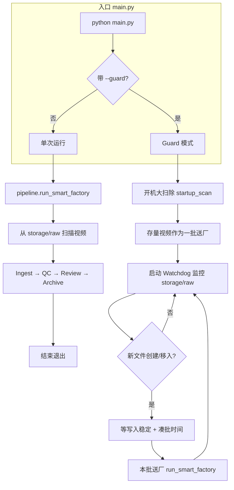
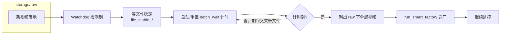
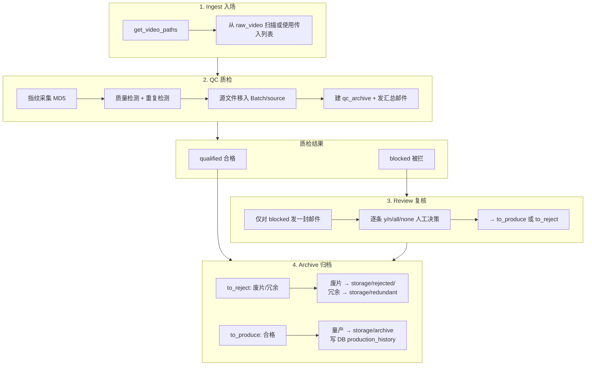
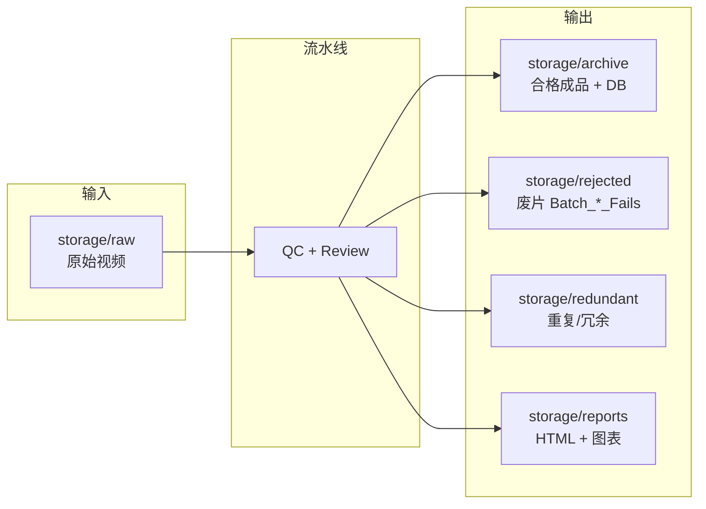
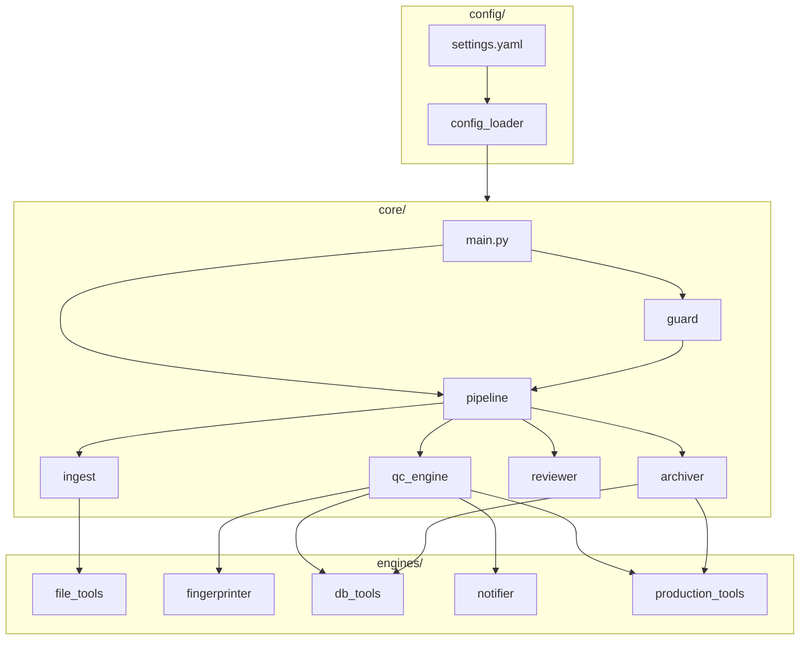

# DataFactory 整体逻辑图

## 1. 入口与运行模式

---

## 2. Guard 模式：监控与凑批

---

## 3. 主流水线：Ingest → QC → Review → Archive

---

## 4. 数据与存储流向

---

## 5. 配置与模块依赖（简图）

---

说明：

- **单次运行**：`python main.py` → 扫一次 raw → 走完整流水线 → 退出。
- **Guard 模式**：`python main.py --guard` → 先处理存量 → 再持续监控 raw，新文件凑批后送厂，循环。
- **流水线**：Ingest 取视频列表 → QC（指纹+质量+重复+邮件）→ 仅对被拦项复核 → 按结果归档到 archive/rejected/redundant，并写 DB、报表。
